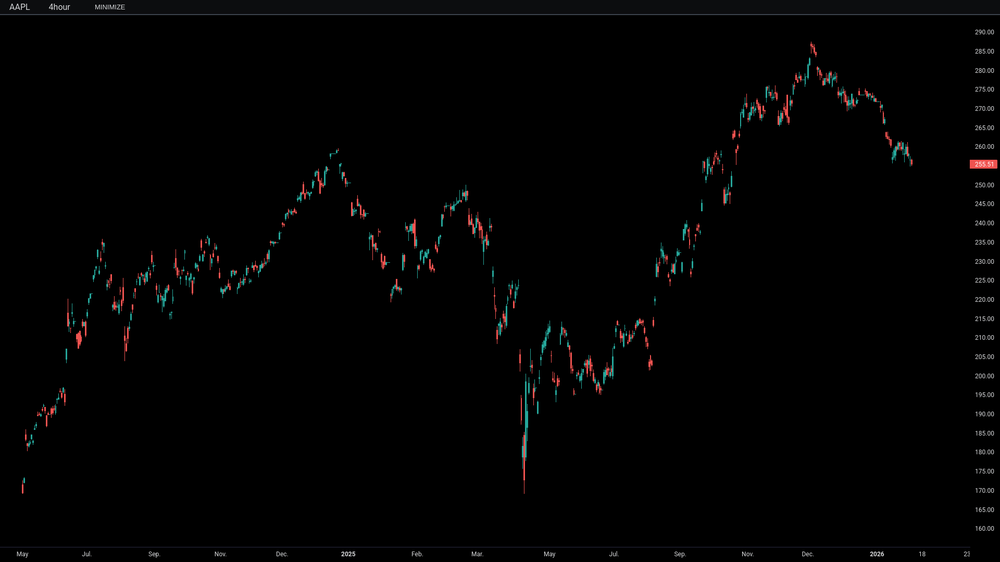
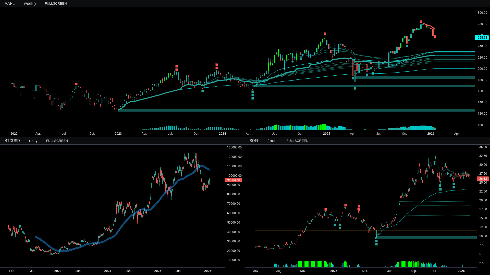

# Tiingo-Screener-Python

Stock screener application that fetches ticker data from the Tiingo API, calculates technical indicators, runs scans, and provides advanced visualization capabilities

## ✨ Application Features
- **Automated Data Pipeline**: Tickers → Indicators → Scans → Visualization
- **Multi-Timeframe Analysis**: Support for daily, weekly, hourly, and minute timeframes
- **Advanced Visualization**: TradingView-style charts using lightweight-charts library
- **Flexible Data Management**: Version-controlled buffer system with save/load/delete capabilities
- **Comprehensive Scanning**: Multiple indicator-based scan criteria
- **Dynamic CLI**: Flexible timeframe specification across all commands

## 📁 Data System Framework

### Buffer & Storage Architecture

```bash
./data/
├── tickers/              # Raw API data buffer
│   └── tickers_*_*/
├── indicators/           # Calculated indicators buffer
│   └── ind_conf_*/
└── scans/                # Scan results buffer
    └── scan_list_*/
```

### Workflow 
`Tiingo API` → `./data/tickers` → `./data/indicators` → `./data/scans`
1. **API Fetch**: Tiingo API → `./data/tickers/`
2. **Indicator Calculations**: Tickers buffer → `./data/indicators/`
3. **Scan Execution**: Indicators buffer → `./data/scans/`
4. **Storage**: Version subfolders can be saved/loaded/deleted in buffers 

### Data Formats
- Stock data fetched as JSON from Tiingo API (www.tiingo.com)
- JSON data converted to pandas Dataframes for manipulation
- Data is stored locally as CSV files in buffer and storage folders
- Data Formats: 
    - Tickers/Indicators: `[TICKER]_[TF]_[DATE].csv` 
    - Scans: `scan_results_[DATE]_[TYPE].csv`

## 📊 Visualization Application

### Visualization Features
- **Multi-Charts**: Load up to 4 charts simultaneously in an app window
- **Custom Indicators**: Plot customized technical indicators
- **Interactive Navigation**: Toggle through tickers, timeframes, and scan results
- **TradingView Style**: Clean, professional charts using lightweight-charts




### Visualization Controls

**General Chart Controls:**
- `Mouse Drag` – Pan charts
- `Scroll Wheel` – Zoom in/out
- `Spacebar` – Toggle minimize all panels
- `Ctrl+C` – Exit application
- `Text Input` – Manual ticker entry

**Per-Chart Controls:**

| Action | Chart 1 | Chart 2 | Chart 3 | Chart 4 |
|--------|---------|---------|---------|---------|
| Maximize | `1` | `2` | `3` | `4` |
| Cycle Timeframes | `6` | `7` | `8` | `9` |
| Cycle Tickers | `-` | `=` | `[` | `]` |
| Screenshot | `_` | `+` | `{` | `}` |
- If a scan_results file is loaded, `-` will cycle results in scan file
    - Otherwise, cycle buttons will cycle indicator buffer files
- Screenshots: 
    - screenshots saved to `./docs/screenshots/`
    - screenshots taken of entire application window
    - screenshots saved as PNG format
    - naming convention: `{TICKER}_{TIMEFRAME}-{DATE_STAMP}-{%H%M%S}`

## 📥 Ticker Data Fetching System

### Fetch Overview

- The fetching system downloads historical price data from Tiingo API for both stocks and cryptocurrencies, supporting multiple timeframes from yearly down to minute-level data
- It includes robust error handling with exponential backoff retry logic for network stability.# Advanced Indicator Configurations

### Timeframes: Aliases & Configurations
| Timeframe | Primary Alias | Other Aliases | Fetched History | Data Type |
|--------|---------|---------|---------|---------|
| Weekly | `daily` | `day`,`1day`,`d` | 20+ years | End-of-day |
| Daily | `weekly` | `week`,`1week`,`w` | 20+ years | Weekly OHLC |
| 4-Hour | `4hour` | `4h` | ~1.7 years | Intraday |
| 1-Hour | `1hour` | `1hour`,`hour`,`1h`,`h` | ~7 months | Intraday |
| 30-Minute | `30min` | `30minutes`,`30m` | ~4 months | Intraday |
| 15-Minute | `15min` | `15minutes`,`15m` | ~4 months | Intraday |
| 5-Minute | `5min` | `5minutes`,`5m` | ~4 months | Intraday |
| 1-Minute | `1min` | `minute`,`1m`,`m` | ~4 months | Intraday |

### Core Fetch Functions

`fetch_tickers()` - **Fetch Batch of Tickers by Timeframe**

Processes multiple tickers across multiple timeframes:

```bash
# Fetch default timeframes for all tickers in TICKERS_LIST (eg. TSX, QQQ, etc)
fetch_tickers(
    timeframes=['weekly', 'daily', '4hour', '1hour'],  # Default
    api_key='your_tiingo_key'
)
```

`fetch_ticker()` - **Fetch Single Ticker**

Fetches historical data for one ticker across specified timeframe:

```bash
# Fetch daily data for Bitcoin
df = fetch_ticker(
    timeframe='daily',
    ticker='BTCUSD',
    start_date='2023-01-01',  # Optional, defaults to max available
    end_date='2023-12-31',    # Optional, defaults to today
    api_key='your_tiingo_key' # From globals.py
)
```

### Ticker File Naming Convention:
```bash
{TICKER}_{TIMEFRAME}_{DATE_STAMP}.csv
```
- `DATE_STAMP`: Format `DDMMYY` (e.g., `010124` for Jan 1, 2024)

### Ticker File Output Structure
```bash
./data/tickers/
├── AAPL_daily_010124.csv
├── AAPL_1hour_010124.csv
├── BTCUSD_daily_010124.csv
├── BTCUSD_1hour_010124.csv
└── ...
```

### Ticker CSV File Contents:
```bash
date,Open,High,Low,Close,Volume
2024-01-01 00:00:00,150.00,152.50,149.75,151.25,1000000
2024-01-02 00:00:00,151.25,153.00,150.50,152.75,1200000
```

## 📈 Indicators
- Calculates technical indicators from raw price data, supporting multiple configuration profiles for different analysis styles 
- Process ticker data through customizable pipelines to generate signals for scanning and visualization

### Indicator Configuration Files
`./src/indicators/ind_configs/`:
├── ind_conf_0.py
├── ind_conf_1.py
├── ind_conf_2.py
├── ind_conf_3.py
├── ind_conf_4.py
└── ...

### Indicator Configuration System

**Configuration File Structure**

- Each indicator config file (`ind_conf_X.py`) contains:
```bash
indicators = {
    'timeframe': [  # List of indicators to calculate
        'indicator1',
        'indicator2'
    ]
}

params = {
    'indicator1': {
        'timeframe': {  # Timeframe-specific parameters
            'param1': value1,
            'param2': value2
        }
    },
    'indicator2': {
        'timeframe': {  # Timeframe-specific parameters
            'param1': value1,
            'param2': value2
        }
    }
}
```

**Example `ind_conf_X.py`**
```bash
indicators = {
    'daily': ['aVWAP', 'aVWAP_channel', 'OB_aVWAP', 'StDev'],
    '4hour': ['aVWAP', 'OB_aVWAP', 'QQEMOD'],
    '1hour': ['aVWAP', 'OB', 'banker_RSI']
}

params = {
    'aVWAP_avg': {
        'daily': {'period': 20, 'smoothing': 2},
        '4hour': {'period': 50, 'smoothing': 3},
        '1hour': {'period': 100, 'smoothing': 4}
    },
    'OB': {
        'daily': {'lookback_period': 20},
        '4hour': {'lookback_period': 50},
        '1hour': {'lookback_period': 100}
    }
}

```

### Customizing Configurations
- Edit the appropriate `ind_conf_X.py` file
- Add/remove indicators from the lists
- Adjust parameters for analysis
- Run with: `python app.py --ind --ind-conf X`

### File Naming Convention:

```bash
./data/indicators/ind_conf_{CONFIG}_{DATE_STAMP}/{TICKER}_{TIMEFRAME}_{DATE_STAMP}.csv
```

### Output Structure
```bash
./data/indicators/
├── ind_conf_1_010124/           # Config-specific folder
│   ├── AAPL_daily_010124.csv
│   ├── AAPL_4hour_010124.csv
│   ├── BTCUSD_daily_010124.csv
│   └── ...
└── ind_conf_2_010124/           # Another config
    ├── AAPL_daily_010124.csv
    ├── AAPL_4hour_010124.csv
    └── ...
```

## 🎯 Scanner & Advanced Configurations

### Scan Configuration Files
Located in `./src/scanner/scan_configs/`:
- scan_conf_1hour.py
- scan_conf_4hour.py
- scan_conf_5min.py
- scan_conf_daily.py
- scan_conf_weekly.py

### Scan Naming Convention
**Scans follow a consistent naming pattern:**
- d_ = Daily timeframe only
- d_ + _h_ = Daily + 1-hour combination
- d_ + _4h_ = Daily + 4-hour combination
- Suffix indicates criteria type: Pinch, Support, Oversold, etc.
- Examples: `d_OBOversold` `d_aVWAPChannelPinch` `d_DivBullish_h_DivBullish`

### Scan Configurations Format and Structure

The scan configs use a configuration system with this **general structure**:

```bash
#./src/scanner/scan_configs/scan_conf_timeframe.py
scan_conf = {
    'scan_name': {                            # Unique scan identifier
        'criteria': {                         # Timeframe → criteria mapping
            'timeframe': 'criteria_name',     # Single criteria per timeframe
            'timeframe': ['criteria1', 'criteria2'],  # Multiple criteria (ALL must pass)
        },
        'params': {                          # Parameter configuration
            'criteria_name': {               # Criteria-specific parameters
                'timeframe': {               # Timeframe-specific parameters
                    'param1': value1,
                    'param2': value2,
                },
                # OR for duplicate criteria on same timeframe:
                'timeframe': [               # Indexed parameters
                    {'param1': value1},      # For first instance
                    {'param1': value2},      # For second instance
                ]
            }
        }
    }
}
```

Examples of customizable scan configs include:

```bash

# Single Timeframe - Single Criteria
'd_OBBullish': {
    'criteria': {
        'daily': ['OB'],  # Single criteria on daily timeframe
    },
    'params': {
        'OB': {
            'daily': {'mode': 'bullish'}  # Parameters for OB criteria on daily
        }
    }
}

# Single Timeframe - Multiple Criteria
'd_aVWAPChannelSupport_OBSupport': {
    'criteria': {
        'daily': ['aVWAP_channel', 'OB'],  # BOTH must pass
    },
    'params': {
        'aVWAP_channel': {
            'daily': {'mode': 'support', 'distance_pct': 5.0}
        },
        'OB': {
            'daily': {'mode': 'support'}
        }
    }
}

# Multi-Timeframe - Multiple Criteria
'd_StDevOversold_h_OBSupport': {
    'criteria': {
        'daily': ['StDev'],      # Criteria on daily
        '1hour': ['OB']          # Criteria on 1-hour
    },
    'params': {
        'StDev': {
            'daily': {'mode': 'oversold', 'threshold': 2}
        },
        'OB': {
            '1hour': {'mode': 'support'}
        }
    }
}

# Single-Timeframe - Single Criteria with Multiple Params
'd_aVWAPChannelPinch': {
    'criteria': {
        'daily': ['aVWAP_channel', 'aVWAP_channel'],  # Two channel checks
    },
    'params': {
        'aVWAP_channel': {
            'daily': [
                {'mode': 'resistance', 'distance_pct': 1.0, 'direction': 'below'},  # Near resistance
                {'mode': 'support', 'distance_pct': 1.0, 'direction': 'above'}      # Near support
            ]
        }
    }
}
```

### Scan Lists

- Custom scan lists are called to run a sequence of scans on indicators data in buffer
- Scan lists are available in the file `./src/scanner/scan_lists.py`:

Scan lists are customizable and have the following format:

```bash
scan_lists = {
    # --- Series of Scans ---
    'scan_list_0': [

        'h_aVWAPChannelPinch',
        '4h_aVWAPChannelPinch',
        'd_aVWAPChannelPinch',
        'w_aVWAPChannelPinch'

    ],

    # --- Single-Timeframe Scans ---
    'scan_list_1': [
        
        'd_StDevOversold_OBBullishaVWAP',

    ],

    # --- Multi-Timeframe Scans ---
    'scan_list_2': [

        'd_OBSupport_h_OBSupport',

    ],
}
```

## 🖥️ CLI Usage Guide

- Values in `[brackets]` represent application CLI inputs.
- Shared `--timeframe` parameter [TF]: Use the same parameter for fetch, indicators, and visualization
- Dynamic timeframes: Specify exactly which timeframes to process for each command

### MAIN FUNCTIONS
| Command | Description | Example |
|---------|-------------|---------|
| `--full-run` | Complete process: fetch > indicators > scan | `--full-run` |
| `--fetch` | Download tickers from API to buffer | `--fetch daily` |
| `--ind` | Calculate indicators from tickers buffer | `--ind --ind-conf 1` |
| `--scan` | Run scanner on indicators buffer | `--scan --scan-list 1` |
| `--vis` | Launch visualization | `--vis --ticker MSFT --timeframe d --ind-conf 1` `--vis --ticker MSFT --timeframe w,d,4h,h --ind-conf 1,2,3,4` `--vis --ticker MSFT,BTCUSD,AAPL,SOFI --timeframe w,d,4h,h --ind-conf 1` |

**`--fetch` Options:**
- `--timeframe [TF]` - Timeframes(s) to fetch (comma-separated e.g., "daily,weekly")
- Default: `weekly,daily,4hour,1hour`

**`--ind` Options:**
- `--ind-conf [VERSION]` - Indicator config (`1`, `2`, `3`, `4`)
- `--timeframe [TF]` - Timeframe(s) to process (comma-separated, e.g., "daily,weekly,4hour")
- Default: All timeframes in tickers buffer

**`--scan` Options:**
- `--scan-list [VERSION]` - Specify scan list (`1`, `2`, `3`, `4`)

**`--vis` Options:**
- `--ticker [SYMBOL]` - Ticker symbol(s) (`BTCUSD`, `BTCUSD,SOFI,AAPL,MSFT`)
- `--timeframe [TF]` - Timeframe(s) (`5min`, `w,d,4h,h`)
- `--ind-conf [VERSION]` - Indicator config(s) (`1`, `1,2,3,4`)
- `--scan-file [FILE]` - Scan results file (`scan_results_*.csv`)

## CLI EXAMPLES

### Fetch Data:
Default `--timeframe`: `weekly,daily,4hour,1hour`
```
python app.py --fetch

python app.py --fetch --timeframe daily,weekly

python app.py --fetch --timeframe 1hour
```

### Calculate Indicators:
Calculate indicators by `--ind-conf` for multiple timeframes using `--timeframes`
```
python app.py --ind --ind-conf 2

python app.py --ind --ind-conf 3 --timeframe daily,weekly

python app.py --ind --ind-conf 1 --timeframe daily
```

### Visualization:
- Visualize multi-charts with any valid matrix of `--ticker` x `timeframe` x `--ind-conf` values
- Visualize charts for scan file from `./data/scans/` using `--scan-file`
```
python app.py --vis --ticker MSFT --ind-conf 1

python app.py --vis --ticker MSFT,AAPL,GOOGL --timeframe d --ind-conf 2,2,2

python app.py --vis --ticker MSFT --timeframe d,w,4h --ind-conf 1,2,3

python app.py --vis --ticker MSFT,SOFI,META,TSLA --timeframe d,w,4h,1h --ind-conf 1,2,3,4

python app.py --vis --scan-file scan_results_20240101.csv
```

### Visualization Examples:

`--vis --ticker BTCUSD --ind-conf 0`


`--vis --ticker BTCUSD --ind-conf 2`


`--vis --ticker AAPL,BTCUSD,SOFI --timeframe w,d,4h --ind-conf 2,1,3`



`--vis --ticker AAPL --timeframe w,d,4h,h --ind-conf 1`


### LIST BUFFER & STORAGE DATA
| Command | Description |
|---------|-------------|
| `--list-tickers` | List ticker files in buffer |
| `--list-ind` | List indicator files in buffer |
| `--list-scans` | List scan files in buffer |
| `--list-tickers-ver` | List saved ticker versions |
| `--list-ind-ver` | List saved indicator versions |
| `--list-scans-ver` | List saved scan versions |
| `--list-screenshots` | List saved screenshots |

### STORAGE DATA MANAGEMENT
| Category | Save | Load | Delete Single | Delete All |
|----------|------|------|---------------|------------|
| **Tickers** | `--save-tickers [NAME]` | `--load-tickers [NAME]` | `--delete-tickers [NAME]` | `--delete-tickers-all` |
| **Indicators** | `--save-ind [NAME]` | `--load-ind [NAME]` | `--delete-ind [NAME]` | `--delete-ind-all` |
| **Scans** | `--save-scan [NAME]` | `--load-scan [NAME]` | `--delete-scan [NAME]` | `--delete-scan-all` |

### BUFFER MANAGEMENT
| Command | Description |
|---------|-------------|
| `--clear-all` | Reset all buffers (preserves versions) |
| `--clear-tickers` | Clear tickers buffer |
| `--clear-ind` | Clear indicators buffer |
| `--clear-scans` | Clear scans buffer |
| `--clear-screenshots` | Clear screenshots buffer |

## 🚀 Installation

**Clone the repository and install requirements:**
```bash
git clone https://github.com/yourusername/tiingo-screener-python.git
cd tiingo-screener-python
pip install -r requirements.txt
```

**Set up your Tiingo API Key in `.src/core/globals.py`:**
```bash
API_KEY = 'your_tiingo_api_key_here'
```

**Run the application:**
```bash
python app.py --help  # View all available commands
```
