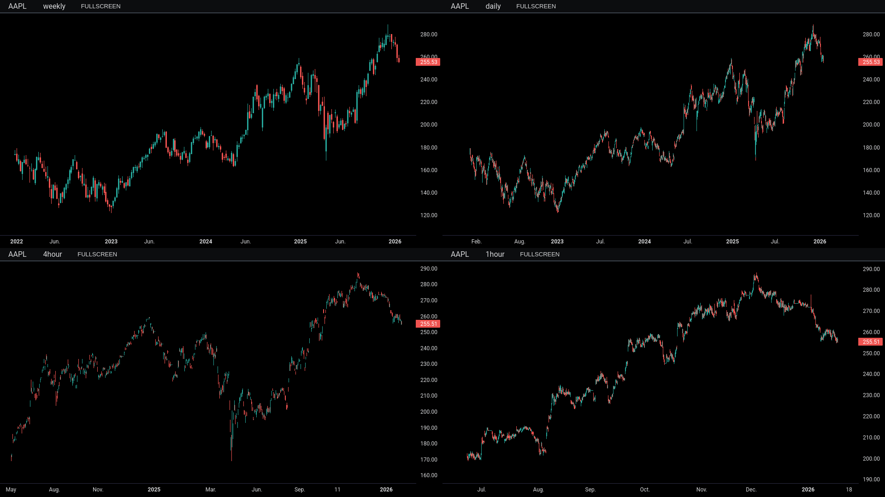
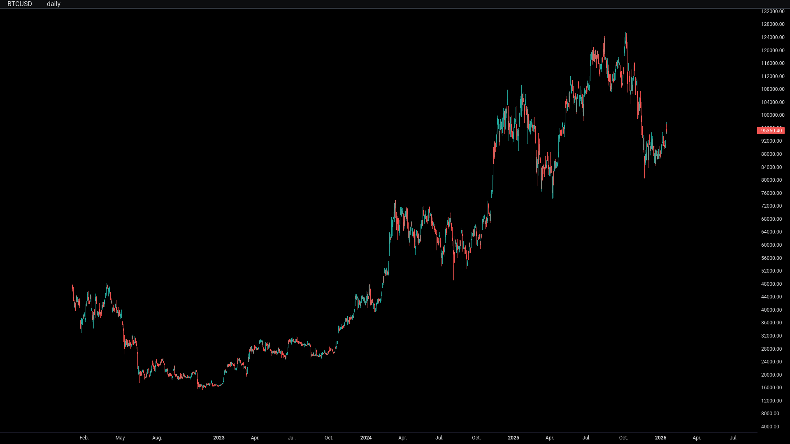
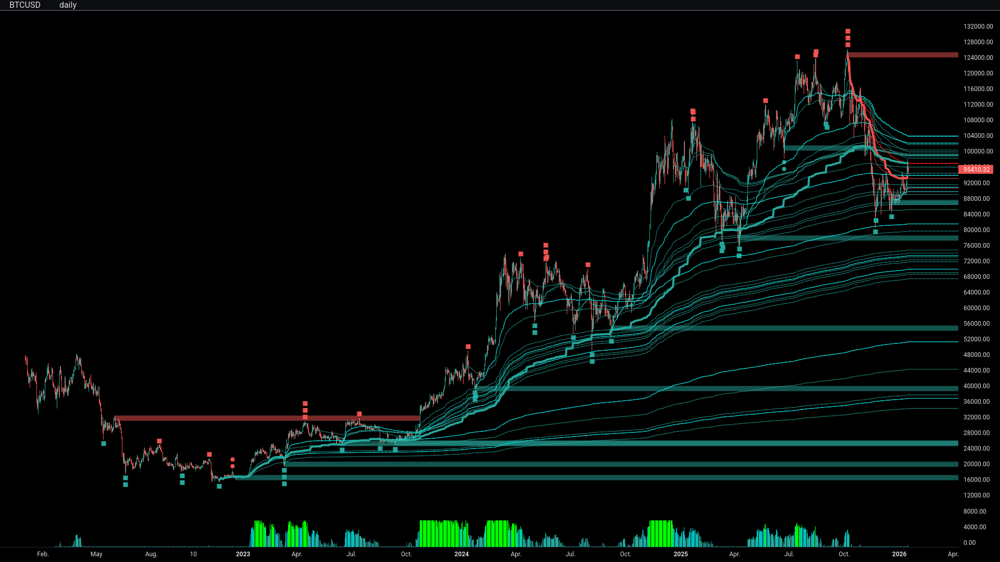
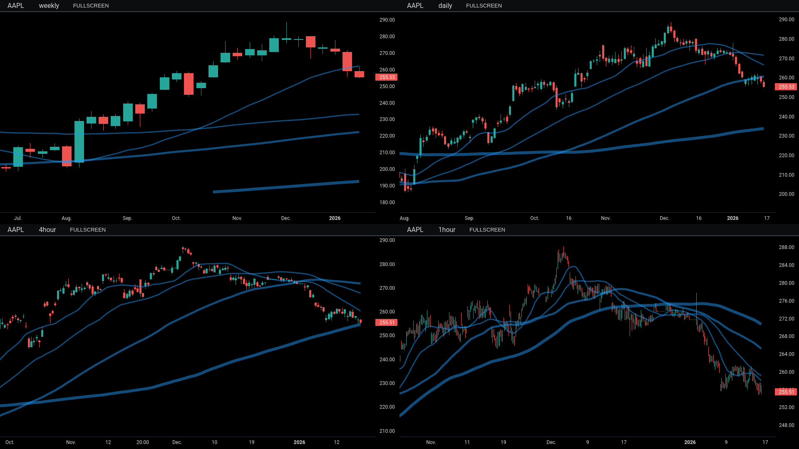

# Tiingo-Screener-Python

Stock screener application that fetches ticker data from the Tiingo API, calculates technical indicators, runs scans, and provides advanced visualization capabilities.

## ✨ Application Features
- **Automated Data Pipeline**: Tickers → Indicators → Scans → Visualization
- **Multi-Timeframe Analysis**: Support for daily, weekly, hourly, and minute timeframes
- **Advanced Visualization**: TradingView-style charts using lightweight-charts library
- **Flexible Data Management**: Version-controlled buffer system with save/load/delete capabilities
- **Comprehensive Scanning**: Multiple indicator-based scan criteria

## 📁 Data System Framework

### Buffer & Storage Architecture

```bash
./data/
├── tickers/              # Raw API data buffer
│   └── tickers_date_*/
├── indicators/           # Calculated indicators buffer
│   └── ind_conf_*/
├── scans/                # Scan results buffer
│   └── scan_list_*/
└── screenshots/          # Visualization screenshots
```

### Workflow
1. **API Fetch**: Tiingo API → `./data/tickers/`
2. **Indicator Calculation**: Tickers buffer → `./data/indicators/`
3. **Scan Execution**: Indicators buffer → `./data/scans/`
4. **Storage**: Version subfolders can be saved/loaded/deleted in buffers 

### Data Format
- Stock data fetched as JSON from Tiingo API (www.tiingo.com)
- JSON data converted to pandas Dataframes for manipulation
- Data is stored locally as CSV files in buffer and storage folders

## 📊 Visualization Application

### Visualization Features
- **Multi-Charts**: Load up to 4 charts simultaneously in an app window
- **Custom Indicators**: Plot customized technical indicators
- **Interactive Navigation**: Toggle through tickers, timeframes, and scan results
- **TradingView Style**: Clean, professional charts using lightweight-charts




### Visualization Controls

**Global Controls:**
- `Mouse Drag` – Pan charts
- `Scroll Wheel` – Zoom in/out
- `Spacebar` – Toggle minimize all panels
- `Ctrl+C` – Exit application
- `Text Input` – Manual ticker entry

**Per-Chart Controls:**

| Action | Chart 1 | Chart 2 | Chart 3 | Chart 4 |
|--------|---------|---------|---------|---------|
| Maximize | `1` | `2` | `3` | `4` |
| Cycle Timeframes | `6` | `7` | `8` | `9` |
| Cycle Tickers | `-` | `=` | `[` | `]` |
| Screenshot | `_` | `+` | `{` | `}` |

**Ticker/Timeframe Cycling is context-dependent**
- If scan_results file is loaded, `-` will cycle through scan results
- Otherwise, button controls will cycle through indicator buffer files

## 🖥️ CLI Usage Guide

Values in `[brackets]` represent application CLI inputs.

### MAIN FUNCTIONS
| Command | Description | Example |
|---------|-------------|---------|
| `--full-run` | Complete process: fetch > indicators > scan | `--full-run` |
| `--fetch` | Download tickers from API to buffer | `--fetch` |
| `--ind` | Calculate indicators from tickers buffer | `--ind --ind-conf 1` |
| `--scan` | Run scanner on indicators buffer | `--scan --scan-list 1` |
| `--vis` | Launch visualization | `--vis --ticker MSFT --timeframe d --ind-conf 1` `--vis --ticker MSFT --timeframe w,d,4h,h --ind-conf 1,2,3,4` `--vis --ticker MSFT,BTCUSD,AAPL,SOFI --timeframe w,d,4h,h --ind-conf 1` |

**--ind Options:**
- `--ind-conf [VERSION]` - Specify indicator config (`1`, `2`, `3`, `4`)

**--scan Options:**
- `--scan-list [VERSION]` - Specify scan list (`1`, `2`, `3`, `4`)

**--vis Options:**
- `--ticker [SYMBOL]` - Specify ticker symbol (`BTCUSD`, `BTCUSD,SOFI,AAPL,MSFT`)
- `--timeframe [TF]` - Timeframe (`5min`, `w,d,4h,h`)
- `--ind-conf [VERSION]` - Indicator list & config (`1`, `1,2,3,4`)
- `--scan-file [FILE]` - Scan results file (`scan_results_*.csv`)


*--vis --ticker BTCUSD --ind-conf 0*

*--vis --ticker BTCUSD --ind-conf 2*

*--vis --ticker AAPL,BTCUSD,SOFI --timeframe w,d,4h --ind-conf 2,1,3*

*--vis --ticker AAPL --timeframe w,d,4h,h --ind-conf 1*

### LIST DATA COMMANDS
| Command | Description |
|---------|-------------|
| `--list-tickers` | List ticker files in buffer |
| `--list-ind` | List indicator files in buffer |
| `--list-scans` | List scan files in buffer |
| `--list-tickers-ver` | List saved ticker versions |
| `--list-ind-ver` | List saved indicator versions |
| `--list-scans-ver` | List saved scan versions |

### DATA MANAGEMENT COMMANDS
| Category | Save | Load | Delete Single | Delete All |
|----------|------|------|---------------|------------|
| **Tickers** | `--save-tickers [NAME]` | `--load-tickers [NAME]` | `--delete-tickers [NAME]` | `--delete-tickers-all` |
| **Indicators** | `--save-ind [NAME]` | `--load-ind [NAME]` | `--delete-ind [NAME]` | `--delete-ind-all` |
| **Scans** | `--save-scan [NAME]` | `--load-scan [NAME]` | `--delete-scan [NAME]` | `--delete-scan-all` |

### BUFFER MANAGEMENT
| Command | Description |
|---------|-------------|
| `--clear-all` | Reset all buffers (preserves versions) |
| `--clear-tickers` | Clear tickers buffer |
| `--clear-indicators` | Clear indicators buffer |
| `--clear-scans` | Clear scans buffer |
| `--clear-screenshots` | Clear screenshots buffer |

## 🚀 Installation

**Clone the repository and install requirements:**
```bash
git clone https://github.com/yourusername/tiingo-screener-python.git
cd tiingo-screener-python
pip install -r requirements.txt
```
